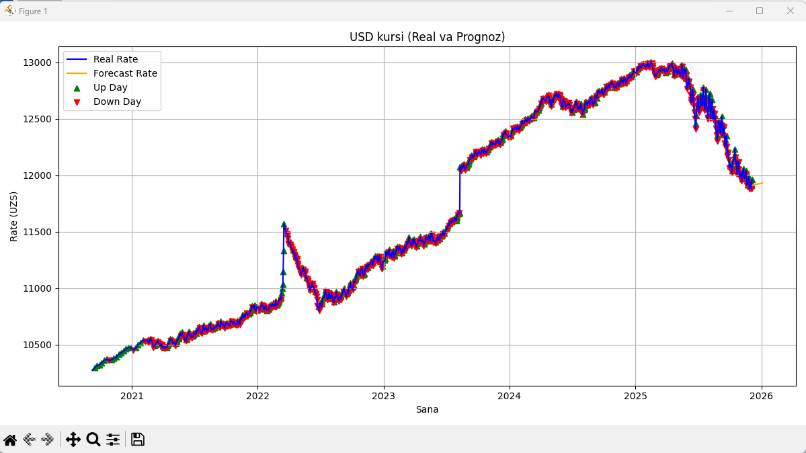

# Valyuta Kursi Bashorati

Bu loyiha O'zbekiston Respublikasi Markaziy bankining arxiv ma'lumotlariga asoslangan holda **USD kursini so'mga nisbatan bashorat qiladi**.  

## Texnologiyalar
- Python
- Pandas
- NumPy
- scikit-learn (MinMaxScaler, LinearRegression)
- Matplotlib

## Funktsional
1. USD kursini CBU API dan olish
2. 7 va 30 kunlik kelajak kursini bashorat qilish
3. Grafikda real va prognoz qilingan kurslarni ko‘rsatish
4. Ko‘tarilgan va tushgan kunlarni belgilash
5. Kod dokumentatsiyasi va izohlar bilan toza tuzilma

---

## Kutubxonalarni o‘rnatish
```
pip install -r requirements.txt
```
---

## Foydalanish

```bash
python main.py
```
---

## Natija


## Litsenziya

MIT License
